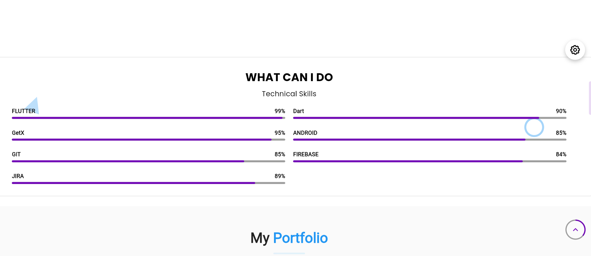
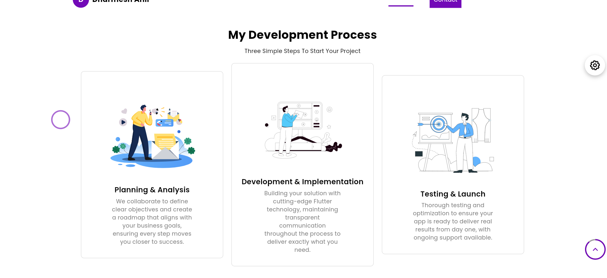
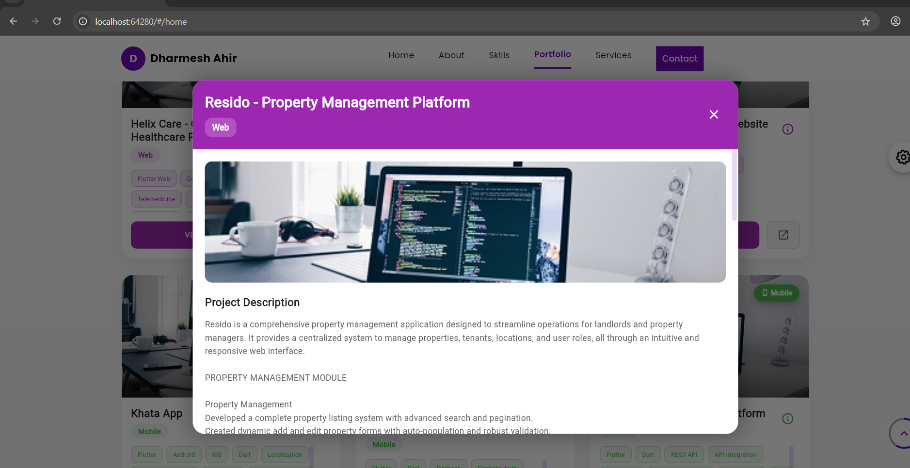
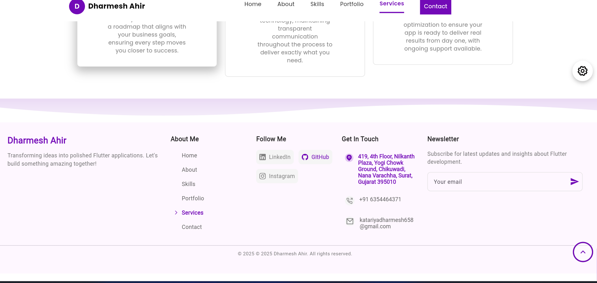

# Dharmesh Purohit - Flutter Developer Portfolio


A modern, responsive portfolio website built with Flutter showcasing my skills, projects, and experience as a Flutter Developer. This single codebase works seamlessly on web, Android, and iOS platforms.

## 🚀 Live Demo

[**View Live Portfolio Website**](https://dharmesh-portfollio-web-fdf8c.web.app/) 

## 📸 Screenshots

| Home Screen | Portfolio | About Me |
|-------------|-----------|----------|
|  |  |  |

| Development | Project Details | Contact |
|-------------|-----------------|---------|
|  |  |  |

## ✨ Features

- **📱 Multi-Platform** - Single codebase for Web, Android, and iOS
- **🎨 Modern UI/UX** - Clean, professional design with smooth animations
- **📊 Portfolio Showcase** - Interactive project gallery with detailed views
- **🛠 Skills Section** - Technical proficiency with visual indicators
- **📞 Contact Integration** - Easy way for potential clients to reach out
- **📄 CV Download** - Direct download link for my resume
- **🌙 Dark/Light Theme** - Theme customization support
- **⚡ Fast Performance** - Optimized for smooth user experience

## 🛠️ Technologies Used

- **Flutter 3.0+** - Cross-platform framework
- **Dart 2.17+** - Programming language
- **GetX** - State management, navigation, and dependency injection
- **Responsive Framework** - Adaptive UI components for all screen sizes
- **Google Fonts** - Typography management
- **URL Launcher** - External link handling
- **Firebase** - Optional backend services (Analytics, Hosting)

## 📦 Installation & Setup

### Prerequisites
- Flutter SDK (3.0 or higher)
- Dart SDK (2.17 or higher)
- Android Studio / VS Code
- Chrome browser (for web testing)

### Steps to Run

1. **Clone the repository**
   ```bash
   git clone https://github.com/your-username/flutter-portfolio.git
   cd flutter-portfolio