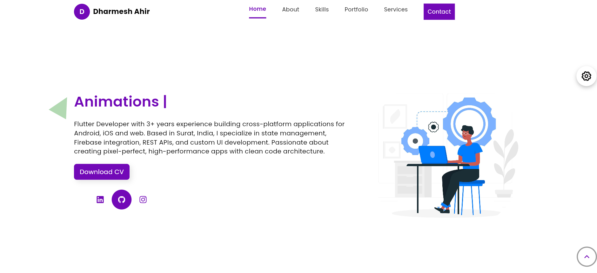

# Dharmesh Portfolio - Flutter Developer


A modern, responsive portfolio website built with Flutter showcasing my skills, projects, and experience as a Flutter Developer.

## 🚀 Features

- **Modern UI/UX** - Clean and professional design
- **Responsive Design** - Works on mobile, tablet, and desktop
- **Portfolio Showcase** - Display projects with images and descriptions
- **Interactive Animations** - Smooth animations for better user experience
- **Contact Form** - Easy way for potential clients to reach out
- **Downloadable CV** - Direct download link for my resume
- **Theme Customization** - Color theming support

## 🛠️ Technologies Used

- **Flutter** - Cross-platform framework
- **Dart** - Programming language
- **GetX** - State management and navigation
- **Firebase** - Backend services (optional)
- **Responsive Framework** - Adaptive UI components

## 📱 Screenshots

| Home Screen | Portfolio | About Me |
|------------|-----------|----------|
|  |  |  |

## 🎨 UI/UX Features

- **Hero Section** with professional introduction
- **Skills Showcase** with progress indicators
- **Project Gallery** with filter options
- **Smooth Animations** and transitions
- **Dark/Light Theme** support
- **Social Media Integration**

## 📦 Installation

1. **Clone the repository**
   ```bash
   git clone https://github.com/your-username/dharmesh-portfolio.git
   cd dharmesh-portfolio